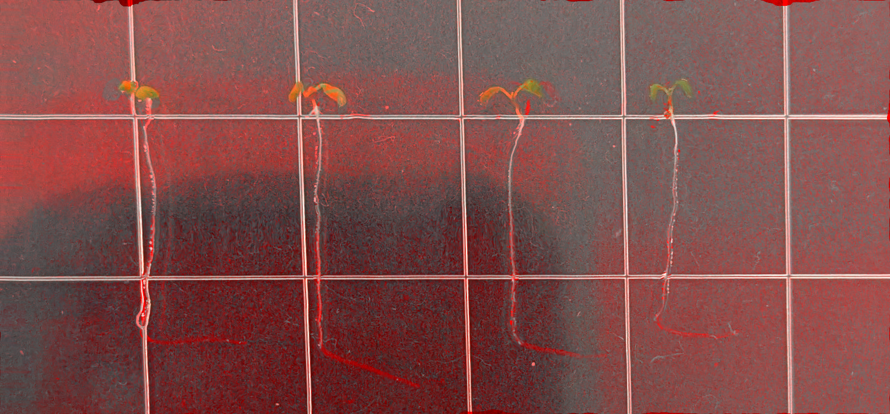

# Petri Dish Change Visualizer (シャーレ変化可視化ツール)

実験前後のシャーレの画像を比較し、**菌の増殖や培地の変化**を可視化するPythonツールです。
単なる差分計算ではなく、特徴点マッチングとオプティカルフローを用いて画像の位置ズレや歪みを補正した後、変化部分のみを「赤色」で強調して合成します。

## 📸 Output Demo

実行結果の例です。左から「実験前」「実験後」「検出結果（赤色が変化部分）」です。

| Before (実験前) | After (実験後) | **Result (解析結果)** |
|:---:|:---:|:---:|
|  |  |  |

> **Note:**
> 結果画像 (`merged_result.png`) では、変化がない部分は元の画像の色合いが保たれ、変化があった部分（増殖・移動）のみが赤くハイライトされます。

## 🚀 Features

* **自動位置合わせ (Auto Alignment):** AKAZE特徴量マッチングにより、撮影時のカメラ位置、角度、ズーム倍率のズレを自動補正します。
* **精密なフィッティング (Optical Flow):** Farneback法を用いて、微細な形状の歪みまで補正して比較します。
* **赤チャネル合成 (Red Channel Merge):** ヒートマップで元画像を塗りつぶすのではなく、元画像の「赤チャネル」に変化量を加算するため、実験対象の視認性を損なわずに変化を確認できます。

## 📦 Requirement

以下のライブラリが必要です。

```bash
pip install opencv-python numpy matplotlib
```

## 💻 Usage

1. 比較したい画像をプロジェクトフォルダに用意します（例: `day0.jpg`, `day3.jpg`）。
2. スクリプトを実行します。

```python
import cv2
# ... (ここに作成した関数を定義、またはimport) ...

# 画像パスを指定して実行
analyze_petri_dish_save_result('day0.jpg', 'day3.jpg')
```

3. 実行後、以下のファイルが生成されます。
    * `diff_image.png`: 純粋な差分（グレースケール）
    * `merged_result.png`: 解析結果（赤色強調画像）

## ⚙️ Parameters (調整)

コード内の以下の変数を変更することで、検出感度や赤みの強さを調整できます。

* **`red_intensity` (default: 1.5)**
    * 数値を上げる (例: 3.0) → 変化部分がより濃い赤になります。
    * 数値を下げる (例: 1.0) → 淡い赤になり元画像が見やすくなります。
* **`diff_thresh` (default: 30)**
    * `cv2.threshold` の第2引数。数値を上げると細かいノイズを無視します。

## 📝 Algorithm

1. **Preprocessing:** 画像の読み込みとグレースケール化。
2. **Alignment (AKAZE):** 特徴点マッチングとホモグラフィ行列による幾何学的補正。
3. **Dense Matching (Farneback):** オプティカルフローによるピクセル単位の位置合わせ（`remap`）。
4. **Difference Calculation:** 補正済み画像と実験後画像の差分を算出。
5. **Channel Merging:** 差分値をBefore画像のRチャネルに加算し、B/Gチャネルから微減算して強調。

## License

[MIT License](LICENSE)

## Acknowlegdements
This code was developed with the assistance of Google Gemini.